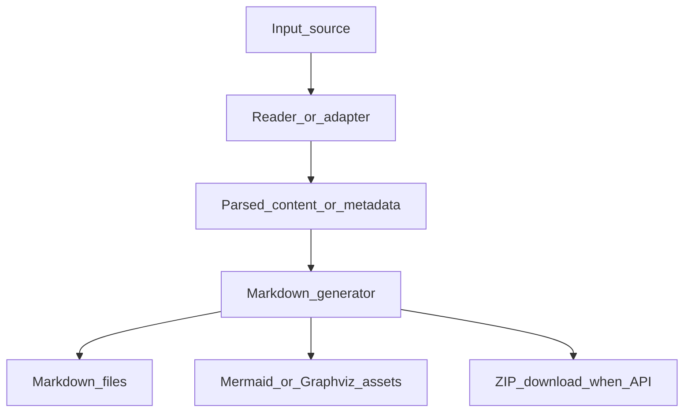

# Data Flow

Data generally flows one way: from input source to generated documentation artifacts. The repository does not define persistent application data stores for the converter services; database and graph modules introspect external systems and write documentation output.
