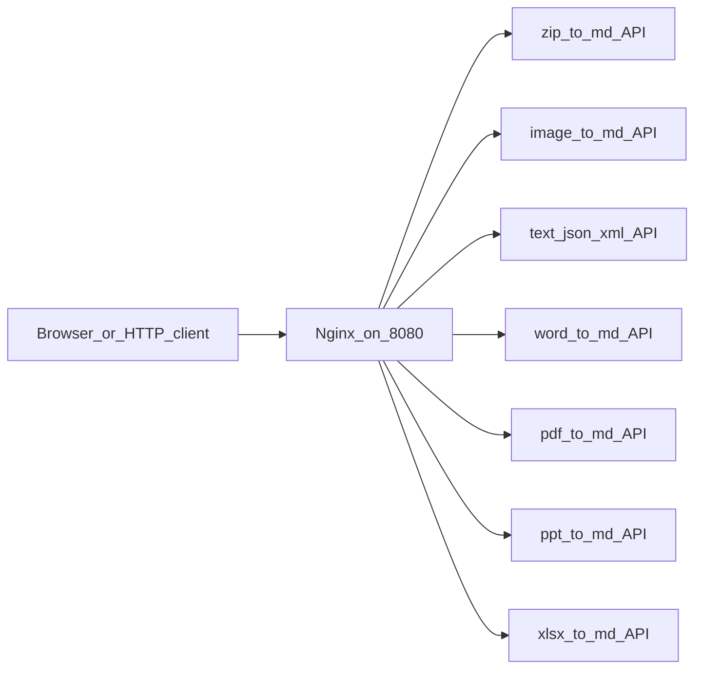

# Deployment Architecture

The checked-in deployment stack is Docker Compose plus nginx. The compose file currently runs the gateway and selected converter APIs: ZIP, image, text, Word, PDF, PPT, and XLSX.



Run it from the repository root:

```bash
docker compose -f deploy/docker-compose.yml up --build
```
