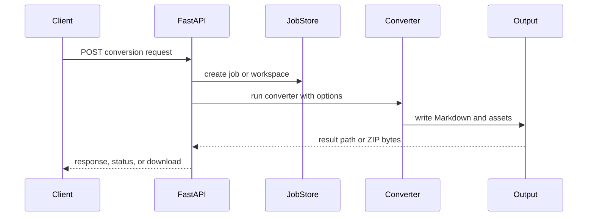

# High-Level Design

## System Boundaries

The system boundary is the `mdengine` distribution. Inputs are files, URLs, database metadata sources, graph sources, OpenAPI specifications, source repositories, logs, and skill markdown bundles. Outputs are Markdown files, ZIP bundles, diagrams, JSON sidecars, and API download artifacts.

## Major Components

- CLI layer: console scripts defined in `pyproject.toml`.
- API layer: FastAPI applications in `src/md_generator/**/api`.
- MCP layer: optional tool servers for automation clients.
- Core converter layer: package-specific conversion and generation logic.
- Deployment layer: Docker Compose plus nginx gateway for selected services.

## Runtime Communication

