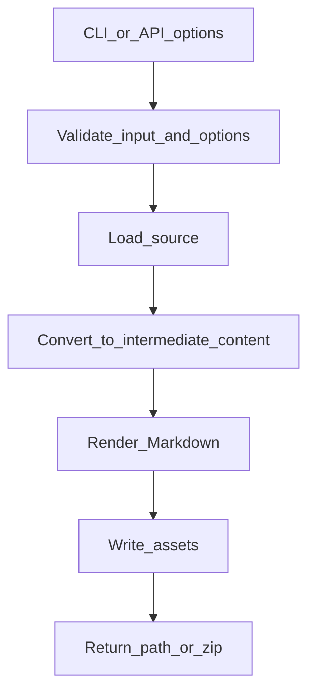

# Low-Level Design

## Shared Converter Shape

Most converter modules follow a small set of conventions:

- `converter.py` provides the CLI entry point or conversion wrapper.
- `api/main.py` provides a FastAPI app where the module supports HTTP.
- Job-enabled APIs write results into temporary workspaces and expose download endpoints.
- Heavy dependencies are isolated behind optional extras.

## Internal Flow

## Error Handling

FastAPI modules convert validation and processing failures into HTTP errors. CLI modules return process exit codes and write errors to the terminal. Domain modules should keep exceptions meaningful at the boundary so API and CLI layers can present actionable messages.
