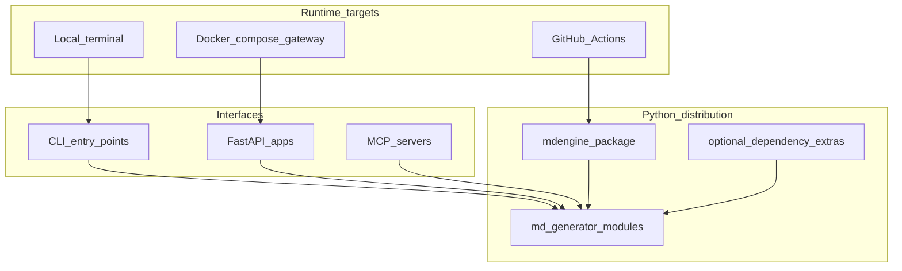

# Architecture Overview

`mdengine` is a modular Python monorepo with one installable distribution and many optional runtime surfaces.

The dominant pattern is a modular monolith. Feature areas share packaging, test configuration, and release cadence while keeping converter logic in separate modules.
