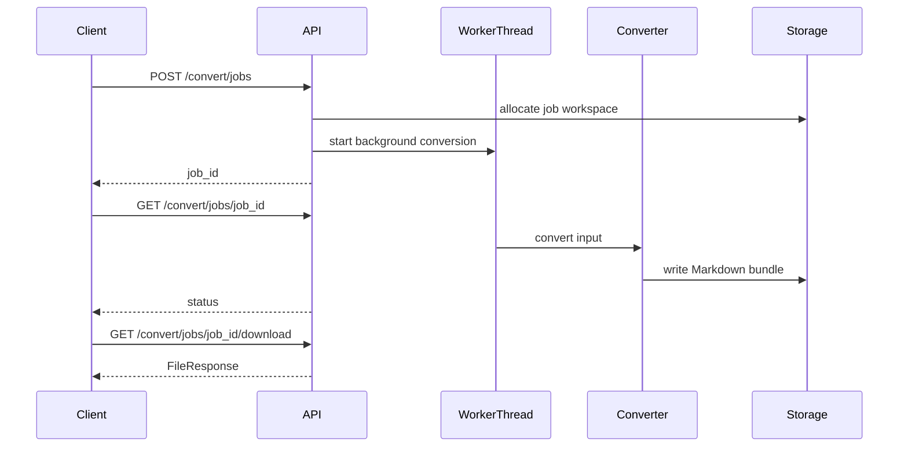
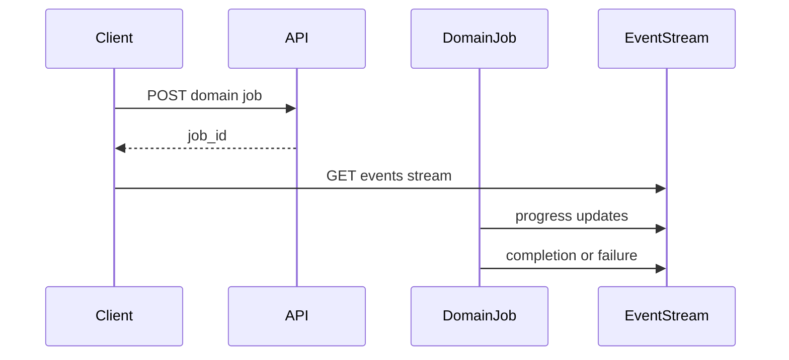

# Sequence Diagrams

## Async Conversion Job

```mermaid
sequenceDiagram
    participant Client
    participant API
    participant WorkerThread
    participant Converter
    participant Storage
    Client->>API: POST /convert/jobs
    API->>Storage: allocate job workspace
    API->>WorkerThread: start background conversion
    API-->>Client: job_id
    Client->>API: GET /convert/jobs/job_id
    WorkerThread->>Converter: convert input
    Converter->>Storage: write Markdown bundle
    API-->>Client: status
    Client->>API: GET /convert/jobs/job_id/download
    API-->>Client: FileResponse
```

## Domain Job With Events

```mermaid
sequenceDiagram
    participant Client
    participant API
    participant DomainJob
    participant EventStream
    Client->>API: POST domain job
    API-->>Client: job_id
    Client->>EventStream: GET events stream
    DomainJob->>EventStream: progress updates
    DomainJob->>EventStream: completion or failure
```
