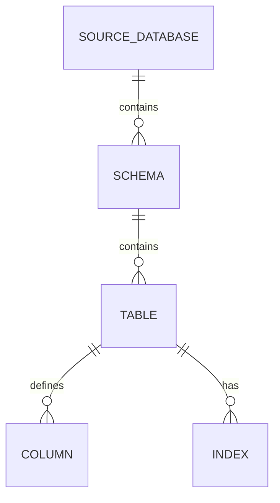

# Database Indexing

The DB exporter can document detected indexes from source databases. Use generated index pages to review uniqueness, coverage, naming consistency, and candidates for query optimization.

