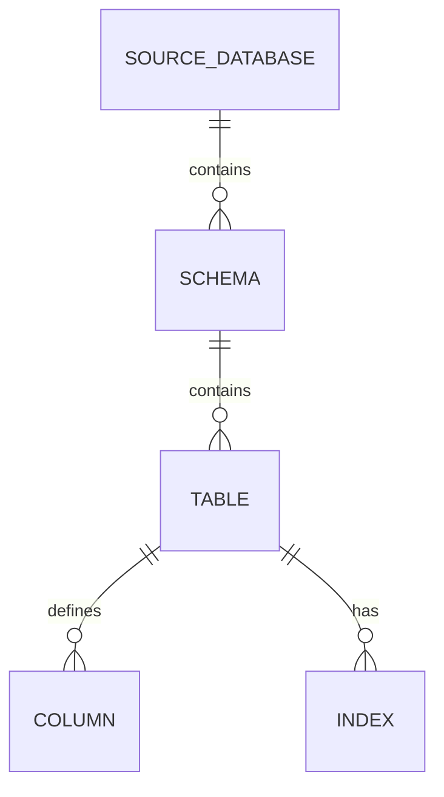

# Database Migrations

No Alembic or Django migration tree was detected for application-owned persistence. For documented databases, migration history remains in the source database or the owning application repository.

