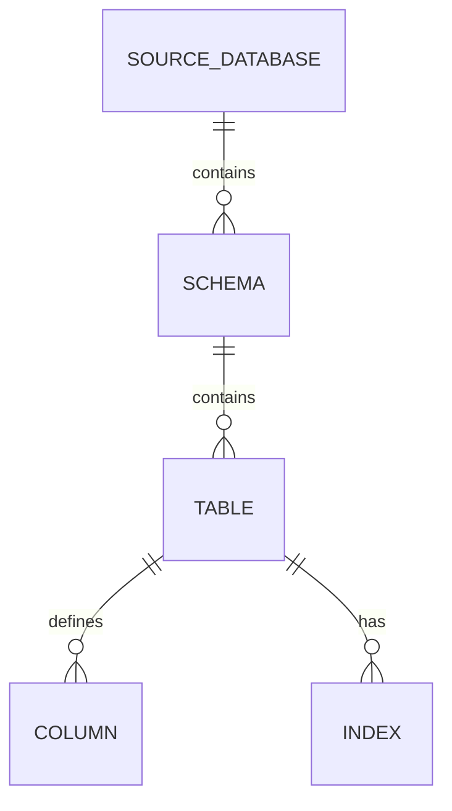

# Database Optimization

Optimization notes should be generated from observed schema shape: large tables, missing foreign keys, index duplication, and expensive graph sizes. Keep extraction limits configured for very large catalogs.

