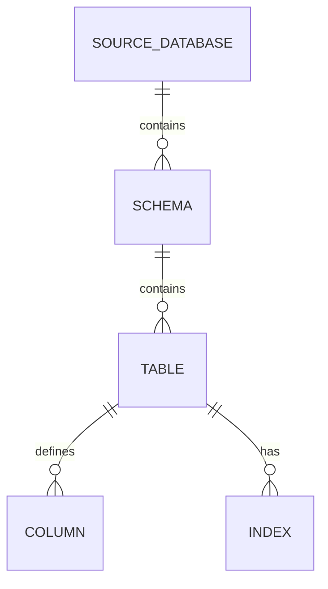

# Database Schema

`mdengine` does not own application tables. The DB module documents external database schemas through adapters for Postgres, MySQL, Oracle, Mongo, and SQLite. Outputs can include tables, views, indexes, routines, triggers, Mongo collections, and ERD artifacts.

