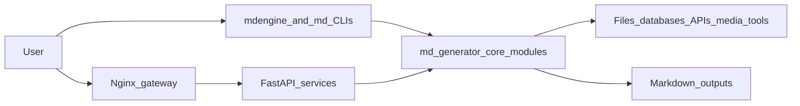

# mdengine Documentation

`mdengine` is a Python 3.10+ documentation and conversion engine. The PyPI distribution is named `mdengine`; all runtime code imports from `md_generator` under `src/md_generator`.

The repository is a modular monorepo. Each converter can be used as a command-line tool, many converters expose FastAPI services, and selected domains provide MCP servers for tool-based automation.

## What This Site Covers

- Installation, local development, and operating guidance for Windows, macOS, and Linux.
- High-level and low-level architecture for the converter, API, MCP, database, graph, codeflow, log, and assistant modules.
- API endpoint families detected in the repository.
- Docker gateway deployment using `deploy/docker-compose.yml` and `deploy/nginx/default.conf`.
- Python reference pages generated with `mkdocstrings` from the `md_generator` package.

## Detected Modules

- `pdf`: PDF (`md_generator.pdf`), CLI `md-pdf`, extra `pdf`.
- `word`: Word (`md_generator.word`), CLI `md-word`, extra `word`.
- `ppt`: PowerPoint (`md_generator.ppt`), CLI `md-ppt`, extra `ppt`.
- `xlsx`: Excel and CSV (`md_generator.xlsx`), CLI `md-xlsx`, extra `xlsx`.
- `image`: Image OCR (`md_generator.image`), CLI `md-image`, extra `image or image-ocr`.
- `text`: Text JSON XML (`md_generator.text`), CLI `md-text`, extra `text`.
- `archive`: ZIP Archive (`md_generator.archive`), CLI `md-zip`, extra `archive plus nested format extras`.
- `url`: URL and Web (`md_generator.url`), CLI `md-url`, extra `url or url-full`.
- `media-audio`: Audio (`md_generator.media.audio`), CLI `md-audio`, extra `audio`.
- `media-video`: Video (`md_generator.media.video`), CLI `md-video`, extra `video`.
- `media-youtube`: YouTube (`md_generator.media.youtube`), CLI `md-youtube`, extra `youtube`.
- `playwright`: Playwright Web Capture (`md_generator.playwright`), CLI `md-playwright`, extra `playwright`.
- `db`: Database Metadata (`md_generator.db`), CLI `md-db`, extra `db`.
- `graph`: Graph Metadata (`md_generator.graph`), CLI `md-graph`, extra `graph`.
- `openapi`: OpenAPI (`md_generator.openapi`), CLI `md-openapi`, extra `openapi`.
- `codeflow`: Codeflow (`md_generator.codeflow`), CLI `md-codeflow or codeflow`, extra `codeflow`.
- `log`: Log Analysis (`md_generator.log`), CLI `md-log`, extra `log`.
- `tools-assistant`: AI Assistant Tools (`md_generator.tools.assistant`), CLI `mdengine ai assist / mdengine ai export`, extra `skill-openai or skill-rag-chroma for optional providers`.
- `tools-skill-builder`: Skill Builder (`md_generator.tools.skill_builder`), CLI `mdengine skill build`, extra `base package`.

## Core Flow

## Repository Source Of Truth

The root `README.md`, `pyproject.toml`, per-converter README files, `codeflow-to-md/docs`, and `ai/` skill documentation remain authoritative sources for contributor-facing details. This MkDocs site organizes those facts into a deployable documentation platform.
