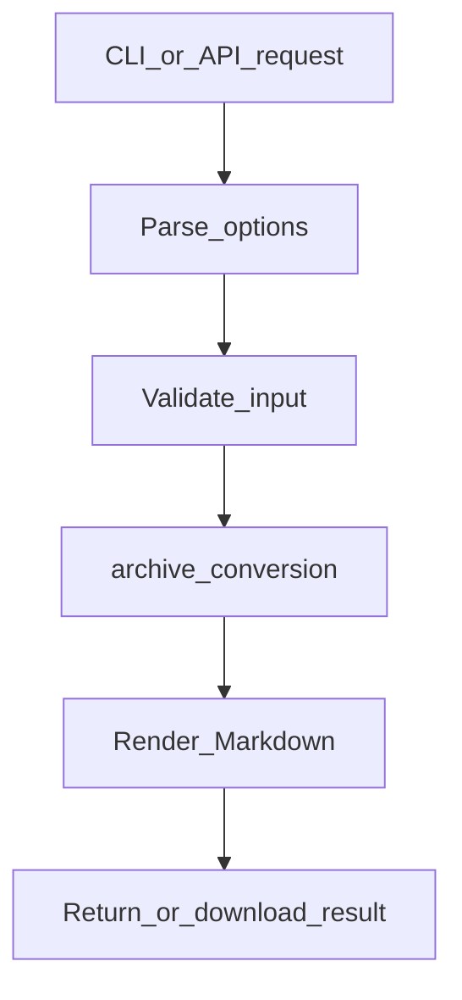

# ZIP Archive Low-Level Design

```mermaid
flowchart TD
    Request[CLI_or_API_request] --> Options[Parse_options]
    Options --> Validate[Validate_input]
    Validate --> Convert[archive_conversion]
    Convert --> Render[Render_Markdown]
    Render --> Return[Return_or_download_result]
```

The module should keep parsing, conversion, rendering, and interface concerns separated enough that CLI and API paths can reuse the same core behavior.
