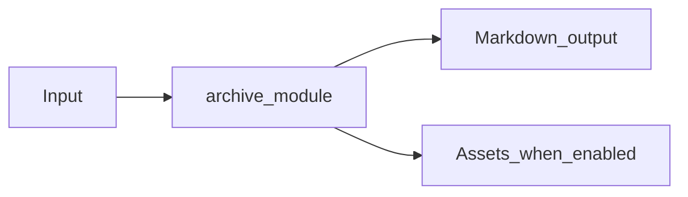

# ZIP Archive Module Overview

Package: `md_generator.archive`  
Source: `src/md_generator/archive`  
CLI: `md-zip`  
Extra: `archive plus nested format extras`

This module accepts ZIP archives and produces Directory-oriented Markdown bundle. It participates in the unified `mdengine` distribution and follows the repository pattern of keeping feature dependencies optional.

