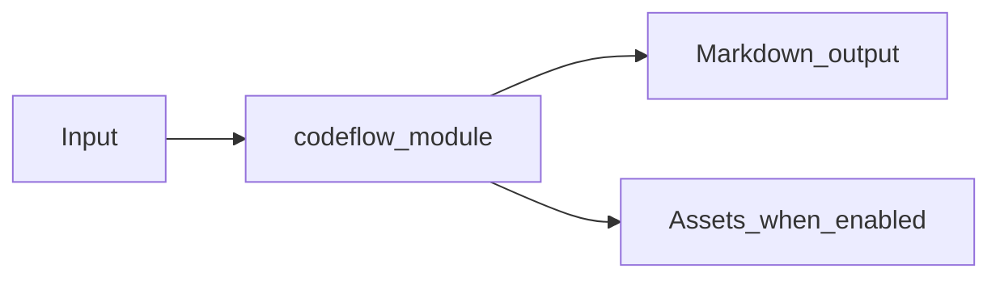

# Codeflow Module Overview

Package: `md_generator.codeflow`  
Source: `src/md_generator/codeflow`  
CLI: `md-codeflow or codeflow`  
Extra: `codeflow`

This module accepts Source repositories and code trees and produces Architecture Markdown, call graphs, flow docs, JSON, Mermaid, and optional HTML. It participates in the unified `mdengine` distribution and follows the repository pattern of keeping feature dependencies optional.

