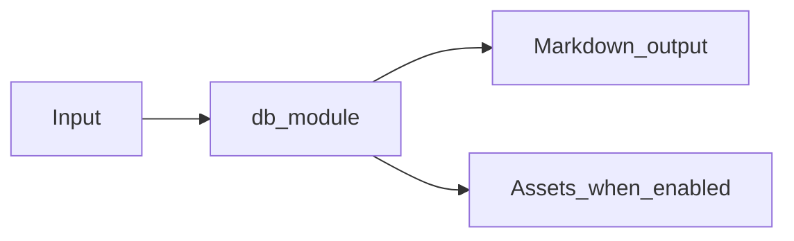

# Database Metadata Module Overview

Package: `md_generator.db`  
Source: `src/md_generator/db`  
CLI: `md-db`  
Extra: `db`

This module accepts Postgres, MySQL, Oracle, SQLite, and Mongo metadata sources and produces Schema documentation, ERD assets, and Markdown bundles. It participates in the unified `mdengine` distribution and follows the repository pattern of keeping feature dependencies optional.

