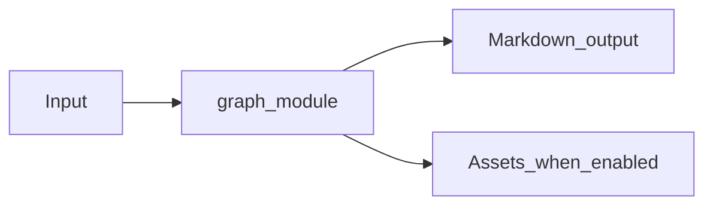

# Graph Metadata Module Overview

Package: `md_generator.graph`  
Source: `src/md_generator/graph`  
CLI: `md-graph`  
Extra: `graph`

This module accepts Neo4j and NetworkX graph sources and produces Graph entity Markdown, summaries, Mermaid, and optional Graphviz artifacts. It participates in the unified `mdengine` distribution and follows the repository pattern of keeping feature dependencies optional.

