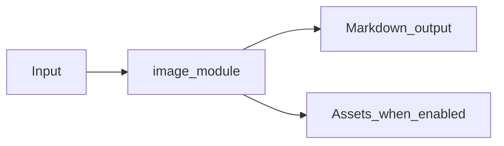

# Image OCR Module Overview

Package: `md_generator.image`  
Source: `src/md_generator/image`  
CLI: `md-image`  
Extra: `image or image-ocr`

This module accepts Image files or directories and produces OCR text and image metadata as Markdown. It participates in the unified `mdengine` distribution and follows the repository pattern of keeping feature dependencies optional.

