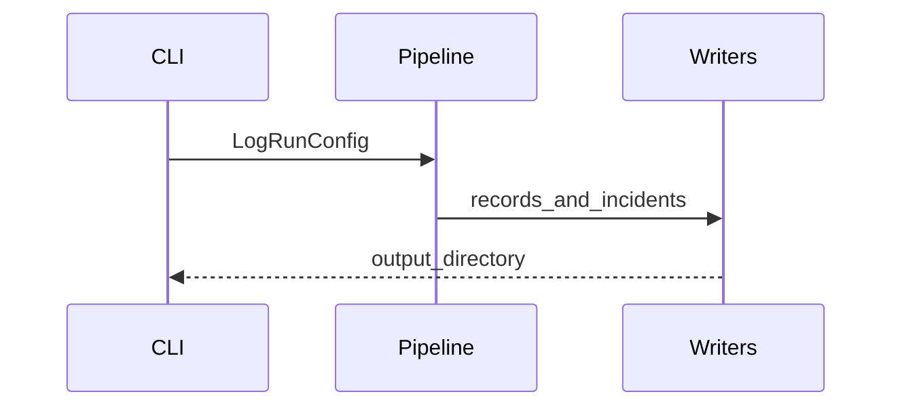

# Log telemetry architecture

The log module normalizes operational logs into AI-oriented Markdown artifacts through staged processing in `md_generator.log.core.pipeline`.

## Stages

1. Ingest and parse log lines into `LogRecord` values.
2. Normalize and enrich records (fingerprints, pattern tags).
3. Aggregate summaries and optional clustering.
4. Intelligence hooks: incidents, semantic chunks, correlation, graphs, timelines, root-cause heuristics.
5. Render Markdown trees and optional embedding-ready exports.

