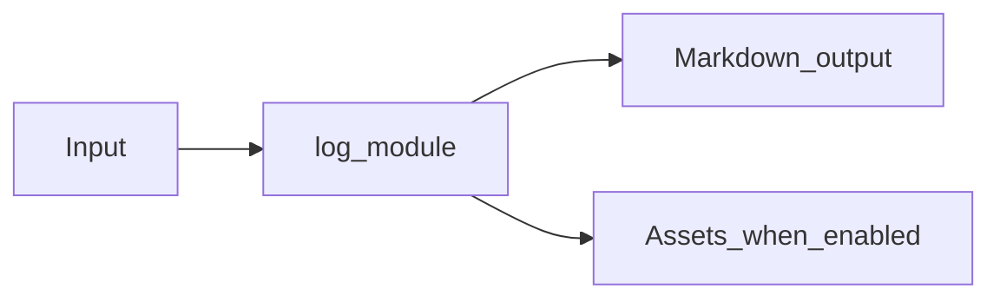

# Log Analysis Module Overview

Package: `md_generator.log`  
Source: `src/md_generator/log`  
CLI: `md-log`  
Extra: `log`

This module accepts Log files and uploaded log content and produces Markdown summaries, parsed events, and optional clustering output. It participates in the unified `mdengine` distribution and follows the repository pattern of keeping feature dependencies optional.

