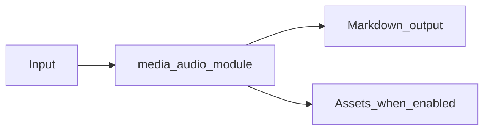

# Audio Module Overview

Package: `md_generator.media.audio`  
Source: `src/md_generator/media/audio`  
CLI: `md-audio`  
Extra: `audio`

This module accepts Audio files and produces Whisper transcript Markdown. It participates in the unified `mdengine` distribution and follows the repository pattern of keeping feature dependencies optional.

