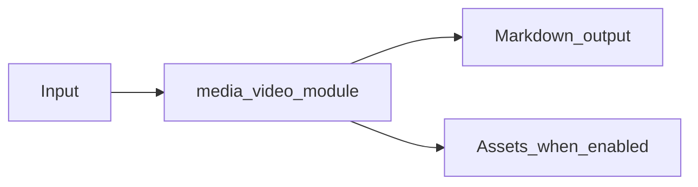

# Video Module Overview

Package: `md_generator.media.video`  
Source: `src/md_generator/media/video`  
CLI: `md-video`  
Extra: `video`

This module accepts Video files and produces Audio transcript Markdown with video metadata. It participates in the unified `mdengine` distribution and follows the repository pattern of keeping feature dependencies optional.

