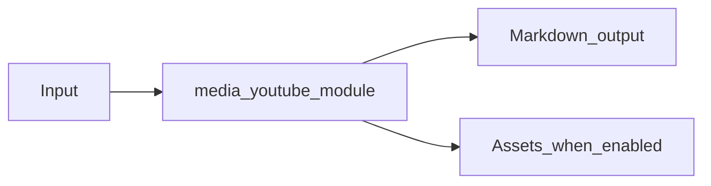

# YouTube Module Overview

Package: `md_generator.media.youtube`  
Source: `src/md_generator/media/youtube`  
CLI: `md-youtube`  
Extra: `youtube`

This module accepts YouTube URLs and produces Transcript and page metadata Markdown. It participates in the unified `mdengine` distribution and follows the repository pattern of keeping feature dependencies optional.

