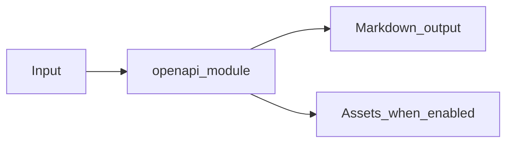

# OpenAPI Module Overview

Package: `md_generator.openapi`  
Source: `src/md_generator/openapi`  
CLI: `md-openapi`  
Extra: `openapi`

This module accepts OpenAPI 3.x or Swagger 2.0 specifications and produces API documentation bundles. It participates in the unified `mdengine` distribution and follows the repository pattern of keeping feature dependencies optional.

