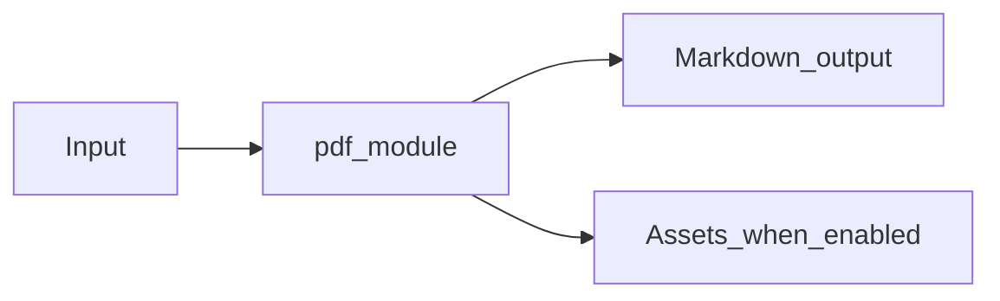

# PDF Module Overview

Package: `md_generator.pdf`  
Source: `src/md_generator/pdf`  
CLI: `md-pdf`  
Extra: `pdf`

This module accepts PDF documents and produces Markdown with optional artifact layout and extracted images. It participates in the unified `mdengine` distribution and follows the repository pattern of keeping feature dependencies optional.

