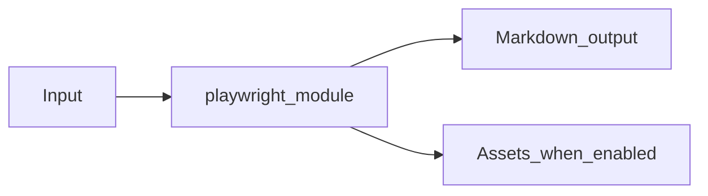

# Playwright Web Capture Module Overview

Package: `md_generator.playwright`  
Source: `src/md_generator/playwright`  
CLI: `md-playwright`  
Extra: `playwright`

This module accepts Rendered web pages and SPAs and produces Markdown captured after browser rendering. It participates in the unified `mdengine` distribution and follows the repository pattern of keeping feature dependencies optional.

