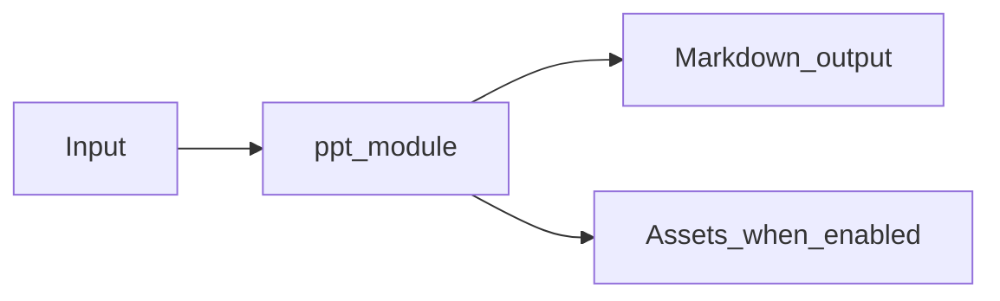

# PowerPoint Module Overview

Package: `md_generator.ppt`  
Source: `src/md_generator/ppt`  
CLI: `md-ppt`  
Extra: `ppt`

This module accepts PPTX slide decks and produces Slide-oriented Markdown and extracted assets. It participates in the unified `mdengine` distribution and follows the repository pattern of keeping feature dependencies optional.

