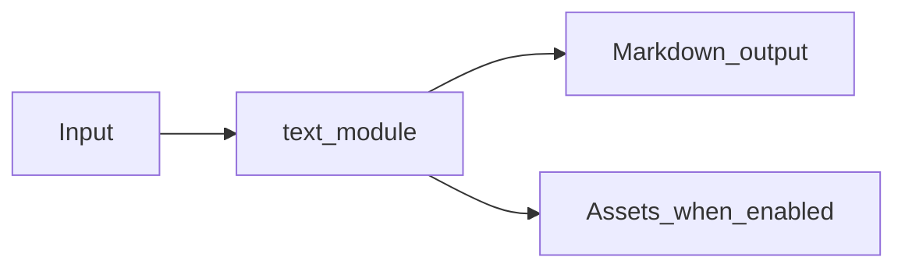

# Text JSON XML Module Overview

Package: `md_generator.text`  
Source: `src/md_generator/text`  
CLI: `md-text`  
Extra: `text`

This module accepts Plain text, JSON, and XML files and produces Readable Markdown representations. It participates in the unified `mdengine` distribution and follows the repository pattern of keeping feature dependencies optional.

