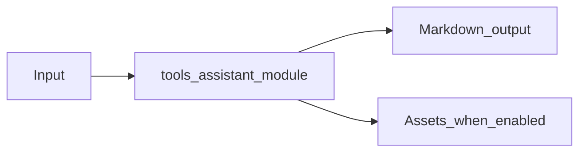

# AI Assistant Tools Module Overview

Package: `md_generator.tools.assistant`  
Source: `src/md_generator/tools/assistant`  
CLI: `mdengine ai assist / mdengine ai export`  
Extra: `skill-openai or skill-rag-chroma for optional providers`

This module accepts Skill markdown bundles and prompts and produces Assembled context and assistant responses. It participates in the unified `mdengine` distribution and follows the repository pattern of keeping feature dependencies optional.

