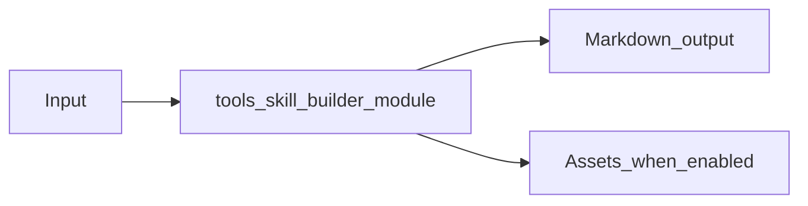

# Skill Builder Module Overview

Package: `md_generator.tools.skill_builder`  
Source: `src/md_generator/tools/skill_builder`  
CLI: `mdengine skill build`  
Extra: `base package`

This module accepts Project metadata and skill sources and produces Structured skill Markdown under ai/. It participates in the unified `mdengine` distribution and follows the repository pattern of keeping feature dependencies optional.

