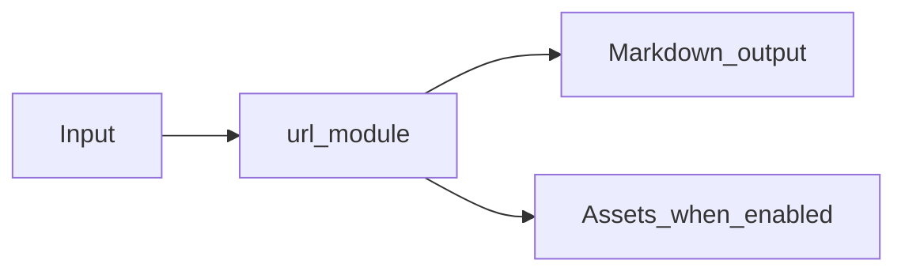

# URL and Web Module Overview

Package: `md_generator.url`  
Source: `src/md_generator/url`  
CLI: `md-url`  
Extra: `url or url-full`

This module accepts HTTP and HTTPS web pages and produces Cleaned Markdown plus optional artifacts. It participates in the unified `mdengine` distribution and follows the repository pattern of keeping feature dependencies optional.

