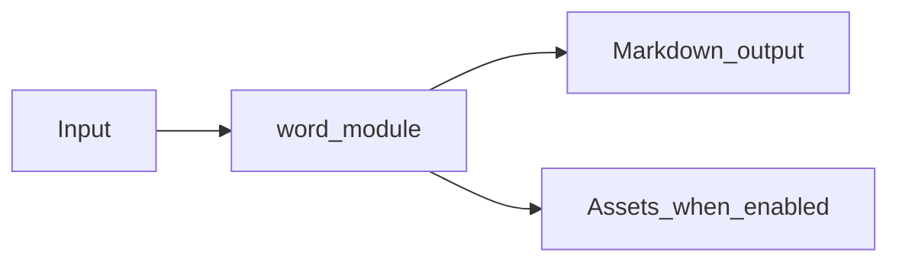

# Word Module Overview

Package: `md_generator.word`  
Source: `src/md_generator/word`  
CLI: `md-word`  
Extra: `word`

This module accepts DOCX documents and produces Markdown with optional image extraction. It participates in the unified `mdengine` distribution and follows the repository pattern of keeping feature dependencies optional.

