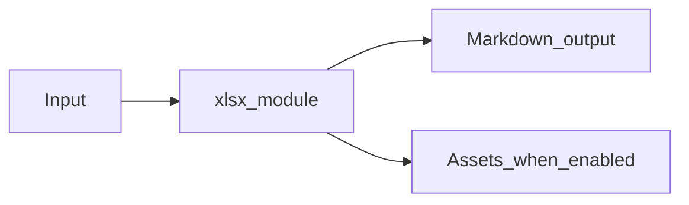

# Excel and CSV Module Overview

Package: `md_generator.xlsx`  
Source: `src/md_generator/xlsx`  
CLI: `md-xlsx`  
Extra: `xlsx`

This module accepts XLSX, XLSM, and CSV files and produces Worksheet or CSV Markdown tables. It participates in the unified `mdengine` distribution and follows the repository pattern of keeping feature dependencies optional.

